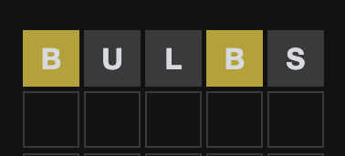

## Solver
Loads the daily wordle puzzle and auto solves it.
`python3 wordle_solver.py`

## Helper
The interactive version lets you enter letter constraints in the commandline, and provides word suggestions.
Run `python3 wordle_helper.py`  

### Not implemented
#### Letter count in the word

Only 1 E in the word.  

At least 2 B's in the word  

